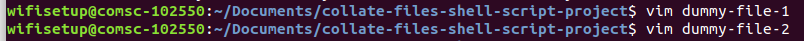
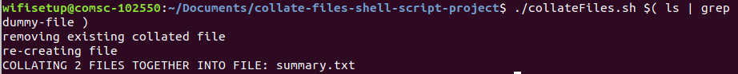
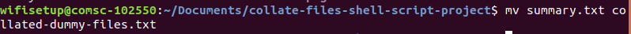

# collate files shell script
collate text files into 1 single file

## todo
* make -f=filename argument to specificy name of generated output file

## how to
1. find or create files you want to collate

2. pass files as arguments to the shell script, tip: using ls and grep is a useful way to filter for specific files as shown in image.

3. output file is called summary.txt rename it with mv command to something more appropriate

4. open collated file!  
[image of screenshot4](./screenshot4.png)
